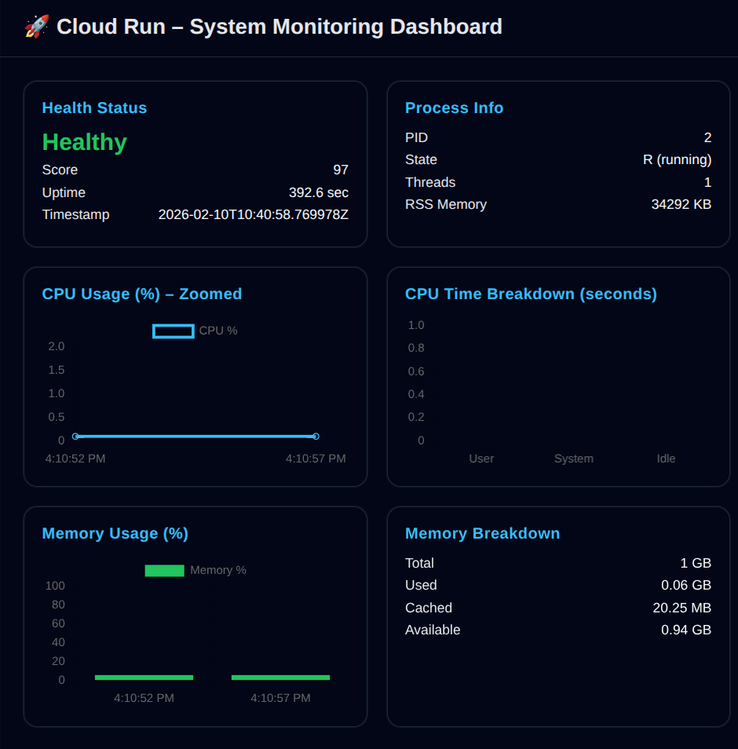

# Cloud Run Advanced System Metrics Dashboard

## Overview
This project demonstrates a production-grade system observability service deployed on **Google Cloud Run**.
It exposes detailed CPU, memory, and process-level metrics from inside a running container and presents them
both as structured JSON and a clean web dashboard UI.

---

## Live Endpoints

| Endpoint | Description |
|--------|------------|
| `/` | Health greeting |
| `/analyze` | JSON metrics API |
| `/dashboard` | Visual system dashboard |

---

## Sample JSON Output (`/analyze`)

```json
{
  "cpu": {
    "cores_logical": 12,
    "source": "/proc/stat",
    "time_breakdown_seconds": {
      "idle": 160406.03,
      "iowait": 0,
      "system": 33.54,
      "user": 111.77
    },
    "unit": "seconds",
    "usage_percent": 0.09
  },
  "memory": {
    "available_kb": 5407208,
    "breakdown_kb": {
      "buffers": 0,
      "cached": 1147196,
      "swap_total": 0,
      "swap_used": 0
    },
    "human_readable": {
      "available_gb": 5.16,
      "total_gb": 6.32,
      "used_gb": 1.16
    },
    "source": "/proc/meminfo",
    "total_kb": 6623156,
    "unit": "kilobytes",
    "used_kb": 1215948,
    "used_percent": 18.36
  },
  "process": {
    "cpu_time_ticks": 11,
    "memory": {
      "rss_kb": 31104,
      "virtual_kb": 187236
    },
    "pid": 2795,
    "source": [
      "/proc/self/stat",
      "/proc/self/status"
    ],
    "state": "S (sleeping)",
    "threads": 3
  },
  "health": {
    "calculation": {
      "cpu_weight": 0.6,
      "memory_weight": 0.4
    },
    "score": 92,
    "status": "Healthy"
  },
  "meta": {
    "container_scope": "cloud-run",
    "note": "metrics reset on container cold start",
    "timestamp": "2026-02-10T09:13:30.680047Z",
    "uptime_seconds": 11.51
  }
}
```

---

## JSON Field Explanation

### CPU
- `cores_logical`: Logical CPU cores available to the container
- `usage_percent`: Active CPU utilization
- `time_breakdown_seconds`: Kernel-level CPU time distribution
- `source`: Linux kernel interface used

### Memory
- `total_kb`, `used_kb`, `available_kb`: RAM statistics
- `breakdown_kb`: Cached, buffer, and swap details
- `human_readable`: UI-friendly memory values
- `source`: Kernel memory interface

### Process
- `pid`: Application process ID
- `state`: Process state (running/sleeping)
- `threads`: Active threads
- `rss_kb`: Real memory used
- `virtual_kb`: Virtual memory allocated

### Health
- `score`: Calculated health score (0–100)
- `status`: Human-readable health
- `calculation`: Weights used for scoring

### Meta
- `timestamp`: UTC time of metric capture
- `uptime_seconds`: Container uptime
- `container_scope`: Execution environment
- `note`: Cloud Run cold-start clarification

---

## Dashboard Preview



---

## Run Locally

```bash
source venv/bin/activate
python main.py
```

Open:
- http://127.0.0.1:8080/dashboard
- http://127.0.0.1:8080/analyze

---
---

## Live Public URL


Open:
- https://raghav-gupta-16968455824.us-central1.run.app/dashboard
- https://raghav-gupta-16968455824.us-central1.run.app/analyze

---
## Build & Deploy

```bash
gcloud builds submit --tag gcr.io/PROJECT-ID/hello-cloud-run
```

```bash
gcloud run deploy hello-cloud-run \
  --image gcr.io/PROJECT-ID/hello-cloud-run \
  --region us-central1 \
  --allow-unauthenticated
```

---

## Key Highlights
- Kernel-level metrics via `/proc`
- Nested, UI-ready JSON
- Cloud Run–aware uptime model
- No unnecessary or misleading data
- Designed for dashboards, alerts, and extensions

---